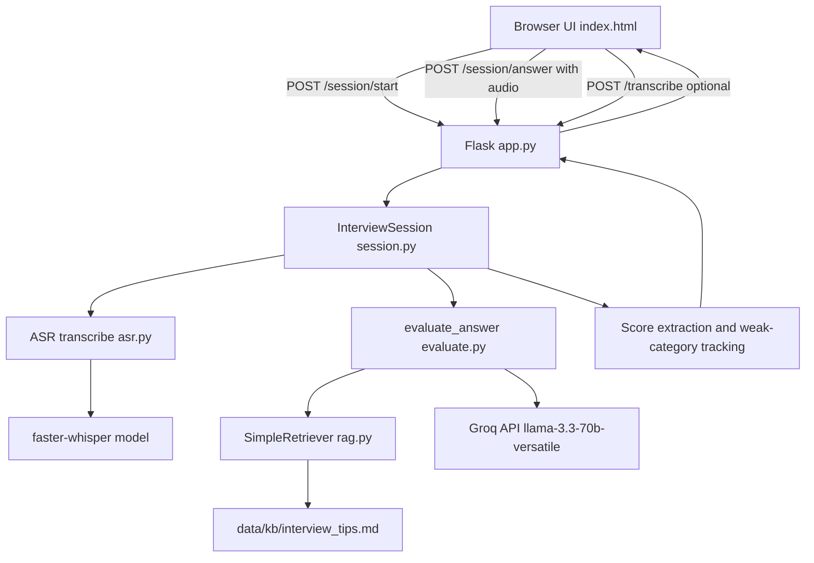
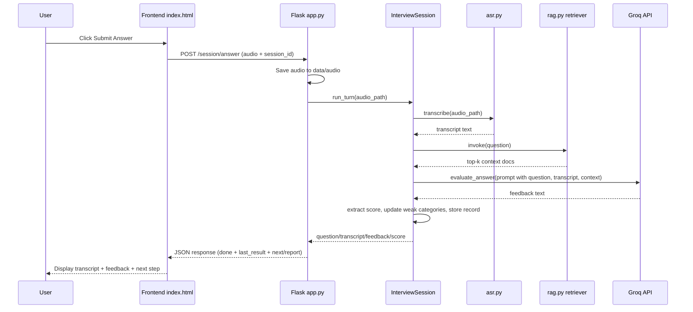

# AI Interview Coach - Detailed Project Walkthrough

## 1. Project Goal

AI Interview Coach is a web app for practicing interview answers with:
- Voice input from the browser
- Speech-to-text transcription (Whisper via faster-whisper)
- LLM feedback generation (Groq)
- Retrieval-grounded evaluation context (local lightweight retriever)
- Multi-question interview session management with adaptive question selection

The product loop is:
1. Start interview session
2. Record answer
3. Transcribe audio
4. Evaluate answer with retrieved coaching context
5. Return score + actionable feedback
6. Ask next question (with weak-area prioritization)
7. Generate final report after max questions

---

## 2. Current High-Level Architecture



---

## 3. Folder and File Roles

## 3.1 Top-Level Files

### README.md
- Human-readable project overview
- Setup and usage guide
- Architecture and endpoint summary

### AI_Interview_Coach_Steps.md
- Historical implementation notes (initial build path)
- Some content reflects earlier architecture (heavier RAG stack) and may differ from current runtime code

### requirements.txt
- Python runtime dependencies currently used by the app:
  - faster-whisper==1.0.3
  - flask==3.1.2
  - groq==1.5.0
  - python-dotenv==1.0.1
  - numpy==1.26.4

### Dockerfile
- Container build configuration
- Installs ffmpeg and Python dependencies
- Copies app source and knowledge base
- Optionally attempts index pre-build

### index.html
- Complete frontend (HTML + CSS + JS)
- Handles:
  - Session start
  - Mic permission and recording
  - Recording finalization status
  - Audio submission
  - Transcript display
  - Feedback display
  - Final report rendering

---

## 3.2 Data Folder

### data/audio/
- Stores uploaded answer files from browser submissions
- Used by Flask endpoints when saving request files

### data/kb/interview_tips.md
- Knowledge base text used for grounding evaluation
- Retrieved snippets are injected into LLM prompt

### data/faiss_index/index.json
- Despite folder name containing "faiss", current implementation stores lightweight JSON index
- Contents:
  - documents (source + full content)
  - vocabulary token-to-index map
  - vectors (bag-of-words vectors serialized to lists)

### data/models/
- Whisper model cache directory
- Prevents redownloading model each run

---

## 3.3 Python Package src/

## __init__.py
- Marks src as a Python package
- Contains only a minimal package marker comment
- No runtime logic

## questions.py
- Defines QUESTION_BANK (list of dicts)
- Each question has:
  - id
  - category
  - text
- This is the canonical source for interview questions

## rag.py
- Implements custom lightweight retriever (no LangChain dependency)
- Main parts:

1. SimpleDocument
- Wrapper class with one field: page_content
- Keeps response shape simple for evaluate.py

2. SimpleRetriever
- Constructor inputs:
  - documents
  - vocabulary
  - vectors
  - k (default top-k)
- Methods:
  - _tokenize(text): alphanumeric tokenization via regex
  - _vectorize(text): bag-of-words vector over known vocabulary
  - _cosine_similarity(a, b): cosine similarity score
  - invoke(query, k=None): ranks docs by similarity and returns top-k as SimpleDocument list

3. build_index()
- Reads markdown files under data/kb recursively
- Builds vocabulary from tokens across documents
- Builds one vector per document
- Writes serialized payload to data/faiss_index/index.json

4. load_retriever(k=3)
- Builds index automatically if file does not exist
- Loads JSON, converts vectors back to numpy arrays
- Returns configured SimpleRetriever

Key behavior details:
- Retrieval is lexical (bag-of-words), not semantic embedding-based
- Fast and lightweight, with minimal dependency footprint
- Works well for small curated knowledge bases

## asr.py
- Handles transcription with faster-whisper
- Main design choices:

1. Lazy model initialization
- Global _model starts as None
- _get_model() creates model only on first transcription request
- Prevents app import-time crash or slow startup

2. Cached model directory
- MODEL_CACHE_DIR = data/models
- download_root points model downloads to local persistent folder

3. Configurable model name
- Uses env var WHISPER_MODEL
- Default: tiny.en (faster first-run download and CPU inference)

4. transcribe(audio_path)
- Calls model.transcribe with beam_size=5
- Joins segment texts into one transcript string

Important runtime implication:
- First-ever transcription may take longer due to model download
- Subsequent runs reuse cached model

## evaluate.py
- Produces LLM feedback for a transcript

Initialization flow:
1. load_dotenv loads .env from project root path
2. _client starts as None (lazy Groq client)
3. retriever = load_retriever() at import time

Functions:

1. _get_client()
- Lazily creates Groq(api_key=...)
- Avoids initialization errors during app import if not needed yet

2. evaluate_answer(question, answer)
- Retrieves top documents for question via retriever.invoke
- Builds prompt from:
  - interview question
  - transcribed answer
  - retrieved coaching context
- Sends to Groq chat completions API
- Returns response text content

Prompt objective:
- Force output with:
  - Score out of 10
  - Strengths
  - Missing/weak areas
  - One specific improvement suggestion

## session.py
- Core session state machine and adaptive logic

Class: InterviewSession

State fields:
- max_questions: upper limit of interview turns
- asked_ids: question ids already asked
- records: per-turn result storage
- weak_categories: categories where score < 6

Methods:

1. _pick_next_question()
- Filters out already asked questions
- If weak_categories exists, prioritizes remaining questions matching those categories
- Otherwise returns first remaining question

2. _extract_score(feedback_text)
- Regex for patterns like "7/10"
- Returns int or None

3. run_turn(audio_path)
- Picks current question
- Transcribes audio via asr.transcribe
- Evaluates transcript via evaluate.evaluate_answer
- Extracts score
- Appends full turn record
- Updates weak_categories when score < 6
- Returns turn payload:
  - question
  - transcript
  - feedback
  - score

4. is_complete()
- True when max questions reached OR no remaining questions

5. generate_report()
- Computes average score over available numeric scores
- Lists weak areas
- Appends full per-question transcript and feedback sections
- Returns markdown report string

## app.py
- Flask entrypoint and HTTP API layer

Global setup:
- app = Flask(__name__)
- ROOT_DIR resolved from src parent
- UPLOAD_DIR = data/audio (created at startup)
- sessions dict stores active InterviewSession instances keyed by session_id

Routes:

1. GET /
- Serves index.html from project root
- Enables opening UI directly at 127.0.0.1:5000

2. POST /transcribe
- Accepts audio file
- Saves to data/audio
- Returns transcript only
- Utility endpoint for isolated ASR testing

3. POST /session/start
- Creates a session with fixed id "demo"
- Instantiates InterviewSession(max_questions=4)
- Returns first question text

4. POST /session/answer
- Validates session_id exists
- Saves uploaded audio file
- Runs session.run_turn
- Returns:
  - done=true with final report when complete
  - done=false with next_question otherwise
- Wrapped in try/except returning JSON error payload on failure

5. GET /health
- Basic health response for liveness checks

App launch:
- host=127.0.0.1
- debug=False
- use_reloader=False
- port=5000

Why use_reloader=False:
- Avoids duplicate processes and restart issues in this environment

---

## 4. Frontend Runtime Flow (index.html)

## 4.1 Session Start
1. User clicks Start Interview Session
2. Frontend calls POST /session/start
3. Stores session_id and shows first question
4. Requests mic permission via getUserMedia({ audio: true })
5. Configures MediaRecorder with preferred mime types

## 4.2 Recording
1. Start Recording:
- Clears previous chunks
- Starts timer
- Disables submit

2. Stop Recording:
- Calls mediaRecorder.stop()
- Shows "Finalizing recording..."
- onstop computes total bytes
- Enables submit only if bytes > 0
- Updates mic status with captured KB or error

## 4.3 Submission
1. Build Blob from recorded chunks with real mime type
2. Send FormData(session_id, audio file) to POST /session/answer
3. Parse JSON response safely
4. Show transcript panel from last_result.transcript
5. Show feedback panel from last_result.feedback and score
6. If done:
- Render report
- Disable further actions
7. Else:
- Move to next question
- Reset recording buffers

Error handling:
- Handles non-JSON responses
- Handles response.ok false with backend-provided message
- Updates mic status when backend fails

---

## 5. End-to-End Backend Flow for One Answer



---

## 6. State and Persistence

## In-memory state
- sessions dict in app.py
- Session id currently fixed as "demo"
- Resets on server restart

## On-disk state
- Uploaded audio files under data/audio
- Retriever index under data/faiss_index/index.json
- Whisper model cache under data/models

Implications:
- No multi-user isolation yet
- No persistent session DB
- Single-process demo design

---

## 7. API Contracts (Current)

## POST /session/start
Response:
```json
{
  "session_id": "demo",
  "next_question": "Tell me about a challenging project you worked on."
}
```

## POST /session/answer
Request form-data:
- session_id (string)
- audio (file)

Non-final response:
```json
{
  "done": false,
  "last_result": {
    "question": "...",
    "transcript": "...",
    "feedback": "...",
    "score": 7
  },
  "next_question": "..."
}
```

Final response:
```json
{
  "done": true,
  "last_result": {
    "question": "...",
    "transcript": "...",
    "feedback": "...",
    "score": 6
  },
  "report": "# Interview Session Report ..."
}
```

Error response example:
```json
{
  "error": "Session not found. Please start a new session."
}
```

---

## 8. Configuration Inputs

## .env
- GROQ_API_KEY must be present for evaluation calls

## Optional env vars
- WHISPER_MODEL
  - Default: tiny.en
  - Can be set to small or others for quality/speed tradeoff

---

## 9. How to Run (Current Recommended)

1. Create and activate venv
2. Install dependencies from requirements.txt
3. Start server from project root:

```bash
source venv/bin/activate
python src/app.py
```

4. Open browser:
- http://127.0.0.1:5000

5. If port conflict occurs:

```bash
fuser -k 5000/tcp
```

Then run server again.

---

## 10. Practical Notes and Known Constraints

1. First transcription can be slow
- Model may download on first use
- Later runs are faster due to local cache

2. Session id is static
- "demo" can collide if multiple clients connect
- Suitable for single-user local testing only

3. Feedback parsing depends on model format
- Score extraction expects x/10 pattern
- If model output changes format, score may be None

4. Retriever is simple lexical matching
- Effective for small curated tips
- Not semantic embeddings; context quality depends on shared vocabulary

5. Error resilience improved
- Backend now returns JSON errors
- Frontend now guards against non-JSON response parsing failures

---

## 11. Suggested Next Technical Improvements

1. Use unique session ids (uuid) instead of fixed "demo"
2. Add persistent storage (SQLite) for session history
3. Add file cleanup policy for old audio uploads
4. Add explicit timeout/retry around Groq API calls
5. Add unit tests for:
- score extraction
- question selection
- endpoint error branches
6. Optionally upgrade retriever to embedding-based retrieval if corpus grows
7. Add per-device microphone selector in UI for better reliability

---

## 12. Quick File-to-Flow Map

- app.py: HTTP boundary, routing, request parsing, response formatting
- session.py: interview workflow brain and adaptive logic
- asr.py: speech recognition service layer
- evaluate.py: prompt construction + LLM call
- rag.py: local knowledge retrieval engine
- questions.py: interview content source
- index.html: user interaction, recording lifecycle, rendering

Together these files implement a full local interview coaching pipeline from voice input to AI feedback and progress reporting.
